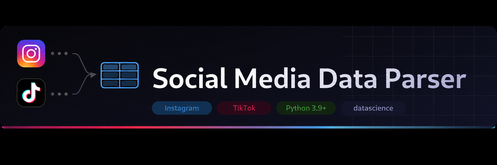

<p align="center">
  
</p>

**Social Media Data Parser** is a Python package that transforms raw Instagram and TikTok data exports into a clean, unified event dataset ready for analysis.

Both platforms are normalized into a consistent schema, enabling you to:

| | |
|---|---|
| 📈 | Explore activity patterns across platforms |
| 🕒 | Analyze usage trends over time |
| 🔍 | Compare behavioral differences between Instagram and TikTok |

All outputs are returned as [`datascience.Table`](https://datascience.readthedocs.io/en/master/) objects, making them compatible with standard data science workflows.

## Table of Contents
- [Installation](#installation)
- [Input Data](#input-data)
- [social_media_events()](#social_media_events()--unified-event-loader)
  - [Parameters](#parameters)
  - [Returns](#returns)
- [Quick Start](#quick-start)
- [Usage Examples](#usage-examples)
  - [Count Events by Platform](#count-events-by-platform)
  - [Count Events by Object Type](#count-events-by-object-type-posts-reels-videos-etc)
  - [Select Only Certain Columns](#select-only-certain-columns)
  - [Count by Hour](#count-by-hour)
- [Creators](#creators)

## Installation
Install Python 3.9+ or ensure it is already installed

Install the package directly from GitHub:
```
!pip install git+https://github.com/lujiec2020/TEEM2.git
```
Install Dependencies 
```
!pip install datascience
!pip install pytz
```
## Input Data

Supported inputs:

- Instagram export (a folder containing the Instagram JSON files)

- TikTok export (a JSON file matching the structure of user_data_tiktok.json)

⚠️Please make sure your files follow this structure — if TikTok data is placed in the Instagram folder, the parser will print a warning and skip it:

```
data/
 ├── instagram_data/
 │    ├── liked_posts.json
 │    ├── post_comments_1.json
 │    ├── reels_comments.json
 │    └── story_likes.json
 └── tiktok_data/
      └── user_data_tiktok.json
```
> **How to export your data:**
> - **Instagram** — Settings → Your activity → Download your information
> - **TikTok** — Settings → Account → Download your data

## social_media_events() — Unified Event Loader

Parses Instagram and TikTok exports, standardizes them into a unified schema, applies optional date filtering and timezone conversion, and returns a combined datascience.Table of all events.

```
social_media_events(
    instagram_folder=None,
    tiktok_json=None,
    start_date=None,
    end_date=None,
    tz="America/New_York"
)
```
### Parameters

| Parameter | Type | Default | Description |
| --- | --- | --- | --- |
| `instagram_folder` | `str` or `None` | `None` | Path to the Instagram export folder. Folder name can be anything — files are detected by content, not filename. Omit to skip Instagram. |
| `tiktok_json` | `str` or `None` | `None` | Path to the TikTok export JSON file. Must follow the official TikTok export structure. Omit to skip TikTok. |
| `start_date` | `str` or `None` | `None` | Only include events on or after this date. Accepted formats: `"MM-DD-YYYY"`, `"YYYY-MM-DD"`, `"MM/DD/YYYY"`. |
| `end_date` | `str` or `None` | `None` | Only include events on or before this date. Same formats as `start_date`. |
| `tz` | `str` | `"America/New_York"` | Timezone for converting timestamps. Any valid [IANA timezone string](https://en.wikipedia.org/wiki/List_of_tz_database_time_zones). |

### Returns
A datascience.Table combining all parsed events into a single unified schema with the following columns:
| Column | Description |
| --- | --- |
| ``platform`` | ``"instagram"`` or ``"tiktok"`` |
| ``action_type`` | Type of user action (like, view, comment, etc.) |
| ``object_type`` | Content type (story, post, video, etc.) |
| ``timestamp`` | Raw timestamp string |
| ``timestamp_dt`` | Parsed timezone‑aware datetime |
| ``target`` | Content or user interacted with |
| ``value`` | Additional metadata |
| ``hour`` | Hour of day the event occurred (0–23) |
| ``weekday`` | Day of the week (e.g., `"Monday"`) |
| ``month`` | Month number (1–12) |
| ``year`` | Year (e.g., `2024`) |
| ``date`` | Date only, without time (e.g., `2024-03-15`) |


## Quick Start
```python
from social_media_functions.parse_metadata import social_media_events

t = social_media_events(
    instagram_folder="data/instagram_data",
    tiktok_json="data/tiktok_data/user_data_tiktok.json"
)

t.show(5)
```


## Usage Examples

### Count Events by Platform
```python
t.group("platform")
```
Output: Table showing the number of events grouped by platform (Instagram vs TikTok).


### Count Events by Object Type (posts, reels, videos, etc.)
```python
t.group("object_type")
```
Output: Table showing counts of events by content type (e.g., videos, stories).


### Select Only Certain Columns
```python
t.select("platform", "action_type", "timestamp")
```
Output: Filtered table showing only selected columns for focused analysis.


### Count by Hour
```python
t.group("hour")
```
Output: Table showing activity frequency by hour of the day.


## Creators

Amreen Adams and Giancarlos Aviles

Questions? Reach out:  
AD70738@umbc.edu  
gaviles1@umbc.edu
